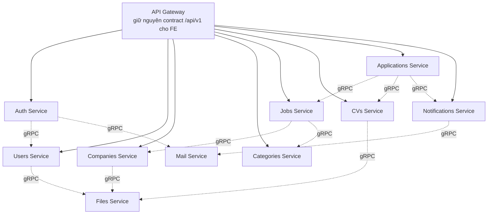

# Kế hoạch tách Microservices (gRPC + CQRS)

> Đây là **kế hoạch**, chưa implement. Việc tách monolith hiện tại (đang chạy tốt, đã qua P1-P8, có test) thành microservices là thay đổi kiến trúc lớn, rủi ro cao nếu làm big-bang — tài liệu này đề xuất lộ trình theo từng bước nhỏ, có thể dừng ở bất kỳ phase nào mà vẫn có giá trị.
>
> Hợp đồng HTTP hiện tại với FE (xem [API_GUIDE.md](API_GUIDE.md)) **không đổi** trong suốt quá trình này — FE luôn gọi 1 origin duy nhất qua API Gateway, không cần biết đằng sau có bao nhiêu service.

---

## 1. Service boundaries đề xuất

Map từ module DDD hiện có (mỗi module đã tách domain/application/infrastructure/presentation sẵn — đây là lợi thế lớn, việc tách service chủ yếu là *di chuyển ranh giới vật lý*, không phải thiết kế lại logic).

| Service | Module hiện tại | Owns (DB) | Ghi chú |
|---|---|---|---|
| **Users Service** | `user` + `auth`'s User persistence | `users`, `user_profiles`, `refresh_tokens` | Nguồn sự thật (system of record) cho `User` — credentials, role, status, profile |
| **Auth Service** | `auth` (trừ phần persist User) | *(không có DB riêng, hoặc cache nhỏ)* | Stateless: issue/verify JWT, orchestrate register/verify/login/reset. Gọi Users Service qua gRPC để đọc/ghi User |
| **Companies Service** | `company` | `companies` | |
| **Categories Service** | `category` | `categories` | |
| **Jobs Service** | `job` | `jobs` | Gọi Companies + Categories qua gRPC khi tạo/sửa job để validate + snapshot tên/logo (pattern này **đã có sẵn** trong code — `CompanySummary`/`CategorySummary` trên `Job` entity — chỉ đổi từ Prisma `include` sang gRPC call) |
| **CVs Service** | `cv` | `cvs`, `experiences`, `educations`, `skills` | |
| **Applications Service** | `application` + `bookmark` | `job_applications`, `bookmarks` | Gộp 2 module nhỏ, cùng nhóm "candidate tương tác với job"; có thể tách riêng nếu muốn bounded context chặt hơn |
| **Notifications Service** | `notification` + `job-alert` | `notifications`, `saved_searches` | Gộp vì cùng là "thông báo cho user", cùng consume event từ Applications/Jobs |
| **Files Service** | `file-upload` | *(không có DB, chỉ proxy S3)* | Dùng chung bởi CVs (upload CV), Users (avatar), Companies (logo) |
| **Mail Service** | `mail` | *(không có DB)* | Dùng chung bởi Auth (verify/reset email), Notifications (digest email) |

→ **9 service**. Đây là điểm khởi đầu hợp lý — không tách quá vụn (mỗi service vẫn có lý do nghiệp vụ rõ ràng để tồn tại độc lập), không quá to (Jobs/CVs/Applications không gộp chung dù có liên quan chặt, vì mỗi cái có nhịp độ thay đổi và tải khác nhau).



---

## 2. API Gateway — FE không đổi gì

Gateway là 1 NestJS app mới, đứng ở đúng chỗ monolith hiện tại đang đứng: nhận HTTP `/api/v1/...` từ FE, dịch sang gRPC call tới đúng service, gộp kết quả nếu cần, trả JSON envelope y hệt hiện tại (`ApiResponse`).

- FE tiếp tục gọi **1 origin duy nhất** — đúng như đã chốt trong [API_GUIDE.md](API_GUIDE.md) mục "Backend là 1 monolith duy nhất" (giờ đổi thành "Gateway là 1 điểm vào duy nhất", FE không cần biết gì thêm).
- Gateway chịu trách nhiệm: `ValidationPipe`, `GlobalExceptionFilter`, `ThrottlerGuard`, CORS — y hệt `main.ts` hiện tại, chỉ khác là controller không tự xử lý logic mà gọi gRPC client.
- Ví dụ 1 endpoint sau khi tách (controller không đổi nhiều, chỉ đổi use-case thành gRPC client call):

```ts
// Trước (monolith): gọi thẳng use-case trong process
async getById(@Param('id') id: string) {
  const result = await this.getJobUseCase.execute(id);
  return ApiResponse.ok(result);
}

// Sau (gateway): gọi qua gRPC client tới Jobs Service
async getById(@Param('id') id: string) {
  const result = await firstValueFrom(this.jobsClient.getJob({ id }));
  return ApiResponse.ok(result);
}
```

---

## 3. CQRS — "Query & Handler" bên trong mỗi service

Dùng `@nestjs/cqrs`. Ý tưởng: mọi hành động nghiệp vụ là 1 **Command** (ghi) hoặc 1 **Query** (đọc), mỗi cái có đúng 1 **Handler**. Đây gần như là refactor cơ học từ pattern "use-case" hiện tại — mỗi `XxxUseCase.execute()` hôm nay gần như đã là 1 handler trá hình, chỉ thiếu việc đăng ký qua `CommandBus`/`QueryBus`.

```ts
// Command — ghi dữ liệu
export class CreateJobCommand {
  constructor(public readonly recruiterId: string, public readonly input: CreateJobInput) {}
}

@CommandHandler(CreateJobCommand)
export class CreateJobHandler implements ICommandHandler<CreateJobCommand> {
  constructor(private readonly jobRepository: IJobRepository, ...) {}
  async execute({ recruiterId, input }: CreateJobCommand): Promise<JobResponseDto> {
    // ...logic y hệt CreateJobUseCase hiện tại...
  }
}

// Query — đọc dữ liệu
export class GetJobQuery {
  constructor(public readonly jobId: string) {}
}

@QueryHandler(GetJobQuery)
export class GetJobHandler implements IQueryHandler<GetJobQuery> {
  constructor(private readonly jobRepository: IJobRepository) {}
  async execute({ jobId }: GetJobQuery): Promise<JobResponseDto> {
    // ...logic y hệt GetJobUseCase hiện tại...
  }
}
```

**Lợi ích cho việc tách service:** transport layer (HTTP controller hôm nay, gRPC method mai sau) chỉ còn nhiệm vụ "dựng Command/Query rồi `bus.execute()`" — logic nghiệp vụ không biết và không quan tâm nó đang được gọi qua HTTP hay gRPC. Nhờ vậy **Phase 1 làm được ngay trong monolith, không cần chờ tách service**, và tách service ở các phase sau không đụng lại logic nghiệp vụ.

---

## 4. gRPC — hợp đồng giữa các service

Mỗi service publish 1 file `.proto` định nghĩa RPC nó cung cấp. Danh sách RPC liên-service cần thiết (không phải toàn bộ, chỉ phần cross-service — trong service vẫn dùng CommandBus/QueryBus nội bộ):

| Caller | Callee | RPC | Mục đích |
|---|---|---|---|
| Auth | Users | `FindUserByEmail`, `CreateUser`, `ValidateCredentials`, `UpdateRefreshToken`, `FindByVerifyCode` | Auth không giữ DB user, mọi thao tác uỷ quyền cho Users |
| Jobs | Companies | `GetCompany` | Validate `companyId` khi tạo job + lấy snapshot tên/logo |
| Jobs | Categories | `GetCategory` | Validate `categoryId` (optional) |
| Applications | Jobs | `GetJob` | Check job đang `OPEN`, lấy `postedById` để check quyền recruiter |
| Applications | CVs | `GetCv` | Check CV đã `PUBLISHED` và đúng chủ sở hữu |
| Applications | Notifications | `NotifyNewApplication`, `NotifyStatusChanged` | Thay cho `EventEmitter2` trong-process hiện tại (xem mục 6) |
| CVs | Files | `UploadFile`, `DeleteFile` | CV upload file có sẵn |
| Users | Files | `UploadFile` | Avatar |
| Companies | Files | `UploadFile` | Logo |
| Auth | Mail | `SendEmail` | Mail xác thực/reset |
| Notifications | Mail | `SendEmail` | Mail digest job-alert |

Định nghĩa `.proto` nên đặt trong 1 package dùng chung (`libs/proto/` trong monorepo — xem mục 7) để mọi service import cùng 1 bản, tránh lệch schema giữa client/server.

---

## 5. Auth xuyên service — dùng JWT stateless, không gọi Auth Service mỗi request

Cách hiện tại (`JwtStrategy` verify local bằng `JWT_SECRET`) **giữ nguyên** — đây chính là lý do JWT phù hợp cho microservices: mỗi service tự verify token bằng key dùng chung, không cần gọi Auth Service qua network cho mỗi request (khác với session-based auth phải hỏi lại server mỗi lần).

Nâng cấp nên làm khi tách thật (không bắt buộc ở bản đầu): đổi từ HMAC (`HS256`, secret đối xứng — mọi service đều cần biết secret, rủi ro nếu 1 service bị lộ) sang **RS256** (khoá bất đối xứng) — chỉ Auth Service giữ private key để ký, các service khác chỉ cần public key để verify.

---

## 6. Event bất đồng bộ (notification) — gRPC không thay được hoàn toàn EventEmitter

`@nestjs/event-emitter` hiện tại (in-process pub/sub cho `job.applied`, `application.status_changed`) **không hoạt động xuyên process** — gRPC là request/response đồng bộ, không phải message bus.

- **Bản đầu (đúng yêu cầu "giao tiếp qua gRPC")**: Applications Service gọi thẳng RPC `Notifications.NotifyNewApplication(...)` ngay sau khi lưu application — đơn giản, nhưng làm Applications Service phụ thuộc uptime của Notifications Service (nếu Notifications down, apply job cũng lỗi trừ khi có retry/timeout hợp lý).
- **Nâng cấp về sau (khuyến nghị, không bắt buộc ngay)**: thêm message broker (Kafka/RabbitMQ/Redis Streams) — Applications Service publish event rồi thôi, Notifications Service tự consume độc lập, không còn phụ thuộc lẫn nhau về uptime. Đây là nâng cấp điển hình mọi hệ gRPC-only sớm muộn cũng cần, nên biết trước để không ngạc nhiên.

---

## 7. Cấu trúc repo

Khuyến nghị bắt đầu bằng **Nest monorepo** (1 repo, nhiều app) thay vì tách repo riêng ngay từ đầu — dễ refactor qua lại trong lúc ranh giới service còn chưa ổn định:

```
apps/
├── gateway/
├── auth-service/
├── users-service/
├── companies-service/
├── categories-service/
├── jobs-service/
├── cvs-service/
├── applications-service/
├── notifications-service/
├── files-service/
└── mail-service/
libs/
├── proto/          # .proto contracts dùng chung
├── common/          # BaseEntity, domain exceptions... (từ src/common hiện tại)
└── cqrs-contracts/   # Command/Query/DTO dùng chung nếu cần
```

Tách thành repo riêng cho từng service chỉ nên làm **sau khi** ranh giới đã chứng minh ổn định qua vài phase — tách sớm quá sẽ phải sửa nhiều lần.

---

## 8. Lộ trình theo phase (không big-bang)

Nguyên tắc: mỗi phase đứng độc lập, dừng ở phase nào cũng có giá trị, không phase nào bắt buộc phải làm hết mới có lợi ích.

| Phase | Việc làm | Rủi ro | Có thể test bằng |
|---|---|---|---|
| **0** | Thêm API Gateway module đứng trước monolith hiện tại (passthrough, chưa đổi gì bên trong) | Rất thấp | Test suite hiện tại (41 test) chạy y nguyên |
| **1** | Refactor use-case → Command/Query + Handler (`@nestjs/cqrs`) **bên trong monolith** | Thấp (behavior-preserving) | Test suite hiện tại + viết thêm test cho handler |
| **2** | Định nghĩa `.proto` cho từng bounded context, dựng gRPC method **trong cùng process** gọi thẳng CommandBus/QueryBus (chưa tách deploy) | Thấp | Gọi thử qua gRPC client nội bộ, so kết quả với HTTP |
| **3** | Tách vật lý service **rủi ro thấp nhất trước**: Mail Service, Files Service (ít service khác phụ thuộc đồng bộ vào chúng) | Trung bình — bắt đầu có network call thật, cần retry/timeout | Gọi qua gRPC thật giữa 2 process, đo latency |
| **4** | Tách Companies Service, Categories Service (nhỏ, ít ghi) | Trung bình | |
| **5** | Tách Users Service + Auth Service (trung tâm — làm sau khi đã quen quy trình) | Cao hơn — mọi service khác cần verify JWT, cần đảm bảo key dùng chung đúng | |
| **6** | Tách Jobs, CVs, Applications/Bookmarks, Notifications (nhóm phụ thuộc nhau nhiều nhất — làm cuối, khi pattern đã ổn định) | Cao nhất | |
| **7** *(tuỳ chọn, có thể không bao giờ cần nếu hệ thống nhỏ)* | Tách database — mỗi service 1 schema/instance riêng, bỏ join chéo bảng | Rất cao — cần chiến lược migrate dữ liệu (dual-write / outbox), rollback khó | |

**Gợi ý mốc kiểm tra trước khi tách DB (phase 7):** ngay từ phase 1-2, có thể enforce "không query chéo aggregate khác module" ở tầng code review (đã gần đúng nhờ kiến trúc DDD hiện tại — mỗi module chỉ tự query bảng của mình, các bảng liên quan lấy qua repository của module khác, không JOIN thẳng SQL). Nếu điều này giữ đúng trong suốt phase 1-6, phase 7 sẽ dễ hơn nhiều vì code đã "sẵn sàng" phân tán dữ liệu.

---

## 9. Đánh đổi cần biết trước khi bắt đầu

- **Độ trễ tăng**: 1 request FE trước đây có thể là 1-2 query SQL trong-process; sau khi tách, cùng request đó có thể thành 3-4 gRPC call tuần tự (vd. apply job: check Job → check CV → save → notify) — cần đo lại latency, cân nhắc gọi song song (`Promise.all`) khi các call độc lập nhau (pattern này monolith hiện tại **đã dùng** ở `ApplyJobUseCase`, chỉ cần giữ nguyên khi đổi sang gRPC).
- **Không còn transaction chéo aggregate**: monolith dùng chung 1 Postgres nên có thể transaction xuyên bảng; tách service (đặc biệt phase 7) mất khả năng này, cần chấp nhận "eventual consistency" hoặc dựng saga/compensating action cho các luồng nhiều bước.
- **Vận hành phức tạp hơn nhiều lần**: 9 service = 9 process cần chạy khi dev local, 9 chỗ cần log/monitor, cần service discovery (hoặc hardcode địa chỉ nếu quy mô nhỏ), cần xử lý retry/timeout/circuit-breaker cho gRPC call thay vì tin tưởng tuyệt đối như gọi hàm local.
- **Không phù hợp nếu team nhỏ / traffic thấp**: nếu đây vẫn là dự án cá nhân/portfolio, chi phí vận hành 9 service có thể lớn hơn lợi ích (scale độc lập, deploy độc lập) mang lại. Cân nhắc kỹ lý do tách trước khi làm quá phase 2.

## 10. Ngoài phạm vi tài liệu này

Theo đúng thống nhất trước đó ("infra làm sau"): Docker/Kubernetes, service mesh, CI/CD multi-service, observability (tracing/metrics tập trung), service discovery production-grade — đều là việc **thật sự cần** để chạy microservices ở production, nhưng không nằm trong plan này. Plan này chỉ tập trung phần **kiến trúc code**: ranh giới service, hợp đồng gRPC, pattern CQRS, lộ trình từng bước.
